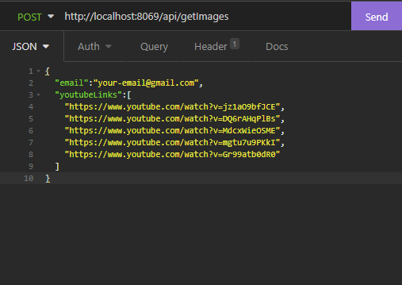
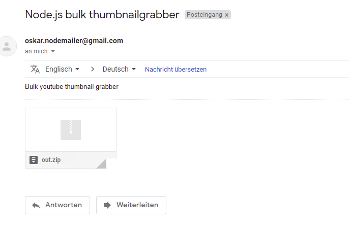
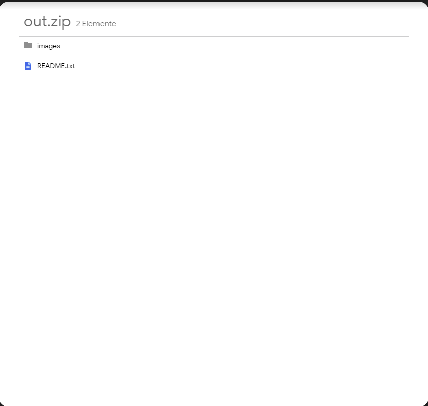
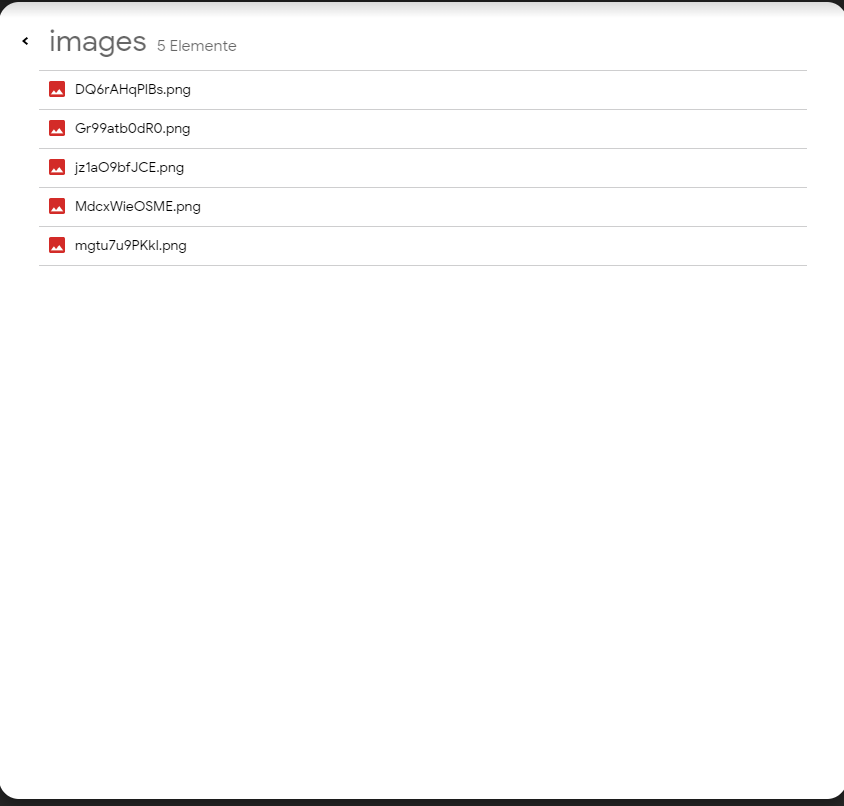

# Bulk YouTube thumbnail grabber
I personally hear alot of different dj sets and sometimes they have some really nice thumbnails.
Input list of youtube links and receive an email, with images packed in an zip, or list to thumbnails in full resolution.

# Installation / Usage
```bash
Git clone https://github.com/Oskar1504/yt-bulk-thumbnailgrabber-api.git
npm install
```
Edit config.json
```json
{
  "email": "your-email@gmail.com",
  "password": "your-password"
}
```
```bash
npm run dev
```
Use [Insomnia](https://insomnia.rest/download) or [postman](https://www.postman.com/downloads/) to test/send post request to application.

If u want to receive an email add the email tag with target email.
Otherwise, just **remove the tag**.



# Note
* if you using an gmail account as sender make sure third party application are allowed using this email
* make sure u added the credentials in the config.json
* Check spam folder if u not receiving any emails

# Sources
* https://morioh.com/p/4b3188bee15c  <= nodemailer refresh (i already used it )
* https://stuk.github.io/jszip/documentation/howto/write_zip.html <= scroll to the bottom node.js example how to write zip

# Images
Response email with attached .zip




